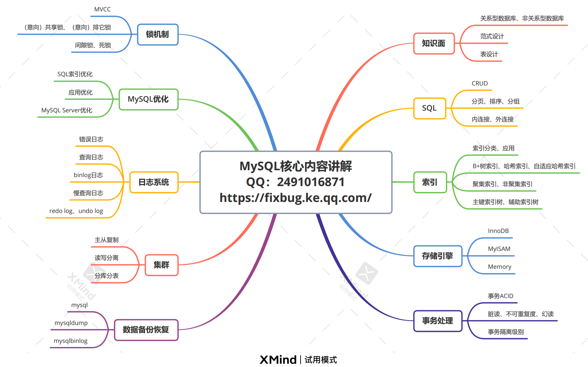

# 知识大纲



# MySQL命令

```shell
#开启
service mysql start

#关闭
service mysql stop

#重启
service mysql restart
```

```shell
#登录进入
mysql -u root -p 

#远程登录
mysql -h 10.0.8.7 -P 3306 -u root -p

#清屏
ctrl l
```

```mysql
#显示数据库
show databases; # 注意分号

#创建数据库
create database serverdb;

#删除数据库
drop database 数据库名;

#使用数据库
use serverdb;

#创建表
CREATE TABLE user(
    username char(50) NULL,
    passwd char(50) NULL
)ENGINE=InnoDB;

#添加数据
INSERT INTO user(username, passwd) VALUES('name', 'passwd');

#显示表
show tables;

#显示数据表结构
describe 数据表名;

#退出
quit 
exit
```

# MySQL数据类型

MySQL数据类型定义了数据的大小范围，因此使用时选择合适的数据类型，不仅会降低表占用的磁盘空间，间接减少了磁盘I/O的次数，提高了表的访问效率，而且索引的效率也和数据的类型息息相关

## 数值类型


> 注意：`age INT(9)`，括号里数字不是字节大小，整型占用内存的大小是固定的，和具体的类型是强相关的，括号里的数字(M)只是代表显示的宽度

## 字符串类型

数据库里字符串用单引号括起来


> char与varchar区别：
>
> - char 表示定长，长度固定，varchar表示变长，即长度可变。char如果插入的长度小于定义长度时，则用空格填充；varchar小于定义长度时，还是按实际长度存储，插入多长就存多长。
>
>   因为char长度固定，char的存取速度还是要比varchar要快得多，方便程序的存储与查找；但是char也为此付出的是空间的代价，因为其长度固定，所以会占据多余的空间，可谓是以空间换取时间效率。varchar则刚好相反，以时间换空间。
>
> - char最多存255个字符，varchar最多存65532个

## 日期和时间类型


> TIMESTAMP会自动更新时间，非常适合那些需要记录最新更新时间的场景，而DATETIME需要手动更
> 新。  
>
> 返回当前系统时间：select now();
>
> 返回一个时间戳：select unix_timestamp(now());  #返回结果是一个从1970年开始的一个秒数

## enum和set

这两个类型，都是限制该字段只能取固定的值，但是枚举字段只能取一个唯一的值，而集合字段可以取任意个值

比如：性别只能取男/女：`sex enum('M', 'W') default 'M'  `

# MySQL运算符

**算术运算符：**+   -   *   /,DIV   %,MOD

**逻辑运算符：**与（AND,&&）、或（OR,||）、非（NOT,!）

**比较运算符：**


比较运算符使用示例：

```mysql
select * from user where sex='M' and score>=90.0;
select * from user where age between 20 and 22;
select * from user where score in (99.0, 100.0); 
select * from user where score is NOT NULL;
select * from user where name like 'zhang%';  /* zhang san, zhang na, zhang yang */
```

**通配符：**

%：替代一个或多个字符

_：仅替代一个字符

# T9完整性约束


# SQL

RDBMS：关系型数据库管理系统（MySQL，Oracle）

RDB：关系型数据库

table：二维表（行：记录；列：字段/属性）

SQL：Structured Query Language，结构化查询语言

- 数据查询：select
- 数据定义：create，drop，alter
- 数据操纵：insert，update，delete
- 数据控制：grant，revoke

外模式 — 视图

模式 — 基本表

内模式 — 存储文件


# MySQL索引

索引：为了更快地查找到数据

**MySQL数据库索引采用的是B+树**


> 举个例子：假设磁盘中的一个盘块容纳16Bytes，而一个关键字2Bytes，一个关键字具体信息指针2Bytes。一棵9阶的B-tree（一个结点最多8个关键字）的内部结点需要2个盘块。而B+树内部结点只需要1个盘块。
>
> 当需要把内部结点读入内存中的时候，B树就比B+树多一次盘块查找时间（在磁盘中就是盘片旋转的时间）

说到底就是因为：==B+树一个非终端结点只存索引项（不存具体信息指针），所以与B树同样大小的结点，B+树可以比B树存更多的索引项==，所以在找某一个索引项的时候，B+树的磁盘IO更少，也就更快，并且B+树更有利于基于范围的查询

**B-树和B+树区别**


# MySQL的存储引擎

存储引擎：用来存储组织数据的格式

 


**InnoDB与MyISAM区别：**

**相同点：**索引都是B+树

**存储结构的区别：**

- MyISAM：表格式，叶子结点上的数据项存的是引用（指针），数据量大的时候用myisam。myisam的B+树索引都是在内存中的，所以myisam可以作全文索引。因为叶子结点存的是指针，所以会有二次寻址。
- InnoDB：数据项实实在在存储在叶子结点上面，数据量小的时候用innodb。innodb的B+树索引的部分叶子结点在内存中，不是全部都在内存

**对于事务的支持：**

- MyISAM：MyISAM不支持事务
- InnoDB：InnoDB支持事务，对数据安全性要求比较高使用InnoDB

**锁的区别：**

- MyISAM：myisam采用的是表级锁

- InnoDB：InnoDB采用的是行级锁，同时也支持表级锁。默认使用的是行级锁，当查找失败的时候，行级锁转变为表级锁


  