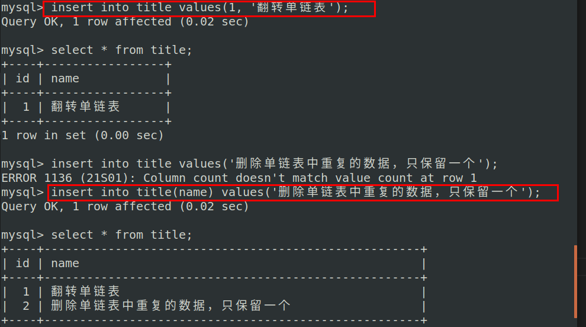

# MySQL命令

```shell
#开启
service mysql start

#关闭
service mysql stop

#重启
service mysql restart
```

```shell
#登录进入
mysql -u root -p 
```

```mysql
#显示数据库
show databases; # 注意分号

#创建数据库
create database serverdb;

#删除数据库
drop database 数据库名;

#使用数据库
use serverdb;

#创建表
CREATE TABLE user(
    username char(50) NULL,
    passwd char(50) NULL
)ENGINE=InnoDB;

#添加数据
INSERT INTO user(username, passwd) VALUES('name', 'passwd');

#显示表
show tables;

#显示数据表结构
describe 数据表名;
```

向表中添加数据



# MySQL索引

索引：为了更快地查找到数据

**MySQL数据库索引采用的是B+树**


> 举个例子：假设磁盘中的一个盘块容纳16Bytes，而一个关键字2Bytes，一个关键字具体信息指针2Bytes。一棵9阶的B-tree（一个结点最多8个关键字）的内部结点需要2个盘块。而B+树内部结点只需要1个盘块。
>
> 当需要把内部结点读入内存中的时候，B树就比B+树多一次盘块查找时间（在磁盘中就是盘片旋转的时间）

说到底就是因为：==B+树一个非终端结点只存索引项（不存具体信息指针），所以与B树同样大小的结点，B+树可以比B树存更多的索引项==，所以在找某一个索引项的时候，B+树的磁盘IO更少，也就更快，并且B+树更有利于基于范围的查询

**B-树和B+树区别**


# MySQL的存储引擎

存储引擎：用来存储组织数据的格式

 


**InnoDB与MyISAM区别：**

**相同点：**索引都是B+树

**存储结构的区别：**

- MyISAM：表格式，叶子结点上的数据项存的是引用（指针），数据量大的时候用myisam。myisam的B+树索引都是在内存中的，所以myisam可以作全文索引。因为叶子结点存的是指针，所以会有二次寻址。
- InnoDB：数据项实实在在存储在叶子结点上面，数据量小的时候用innodb。innodb的B+树索引的部分叶子结点在内存中，不是全部都在内存

**对于事务的支持：**

- MyISAM：MyISAM不支持事务
- InnoDB：InnoDB支持事务，对数据安全性要求比较高使用InnoDB

**锁的区别：**

- MyISAM：myisam采用的是表级锁

- InnoDB：InnoDB采用的是行级锁，同时也支持表级锁。默认使用的是行级锁，当查找失败的时候，行级锁转变为表级锁


  